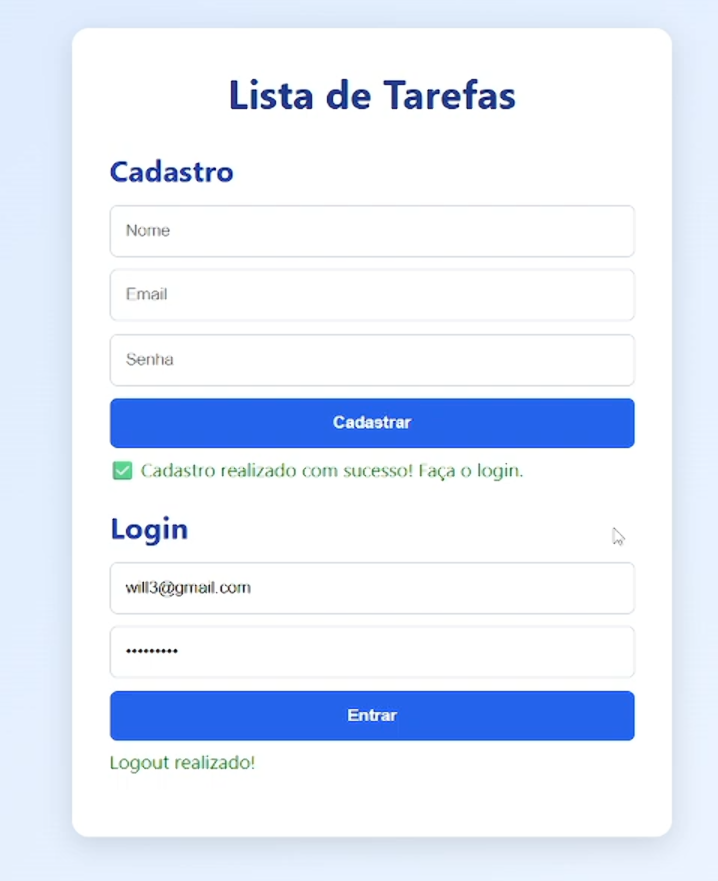

# ✅ Todo List com Autenticação e API

Aplicação web desenvolvida como projeto acadêmico com foco em **desenvolvimento front-end**, consumo de **API REST**, autenticação e operações CRUD.

O sistema permite que usuários se cadastrem, façam login e gerenciem suas próprias tarefas, com persistência via API externa.

---

## 🚀 Tecnologias Utilizadas

### Front-end

- HTML5
- CSS3
- JavaScript (Vanilla)

### Integração

- Consumo de API REST via `fetch`
- Autenticação com JWT (armazenado no `localStorage`)

---

## 🧠 Conceitos Aplicados

- Manipulação do DOM
- Programação assíncrona (Promises / async / await)
- Consumo de API REST
- Autenticação e autorização via token
- Operações CRUD (Create, Read, Update, Delete)
- Organização de código em funções
- Separação de responsabilidades (HTML, CSS e JavaScript)
- Feedback visual para o usuário (mensagens de erro e sucesso)

---

## ⚙️ Funcionalidades

### 👤 Autenticação

- Cadastro de usuário
- Login com validação
- Logout
- Controle de sessão com JWT

### 📝 Tarefas

- Criar tarefa
- Listar tarefas do usuário autenticado
- Editar título da tarefa
- Marcar tarefa como concluída ou pendente
- Excluir tarefa

---

## 📸 Preview

---

## 🔧 Como executar o projeto

### Pré-requisitos

- API backend em execução (endereço configurado no arquivo `scripts.js`)

### Passos

1. Clone o repositório
2. Abra o arquivo `index.html` no navegador
3. Certifique-se de que a API esteja rodando em:
